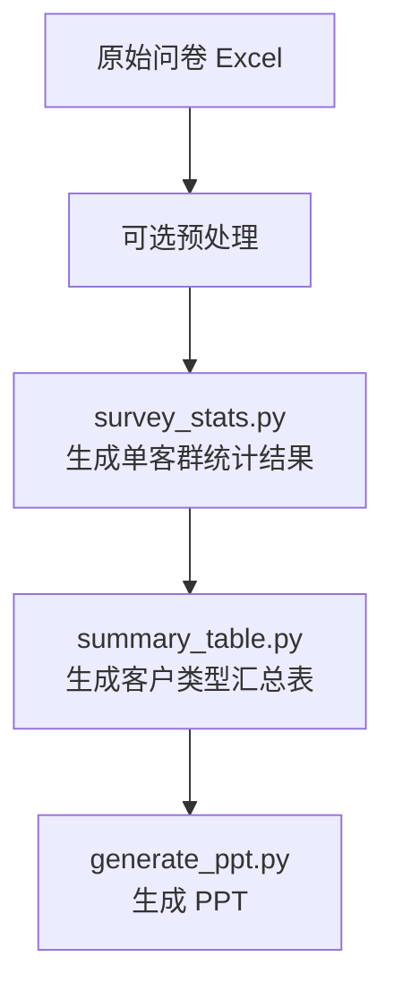
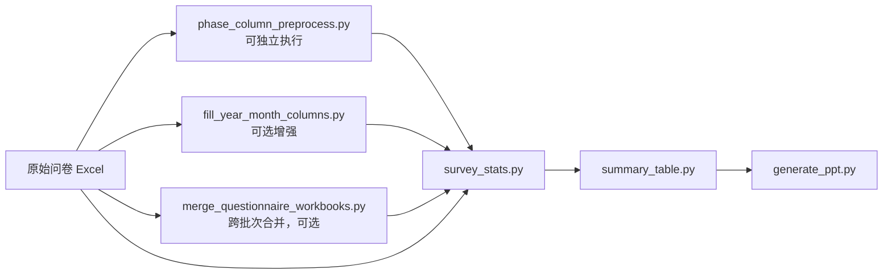

# 整体工作流与运行顺序

本文把当前代码库中的脚本按“真实业务流水线”重新整理，方便后续整合成带界面的整体平台。

## 一句话结论

当前业务上的主干执行顺序应理解为：

`原始问卷 Excel -> 可选预处理 -> survey_stats.py -> summary_table.py -> generate_ppt.py`

也就是说，从“操作顺序”上看，是先生成分项统计结果，再生成汇总表，最后再生成 PPT。

## 当前模块分层

### 1. 数据预处理层

这一层处理“原始问卷 Excel”，主要脚本有：

- `phase_column_preprocess.py`
  - 检查 `问卷数据` sheet 第三列是否是 `一期`、`二期` 这类期次列
  - 如果命中，就把第三列移动到最后一列并原地保存
- `fill_year_month_columns.py`
  - 给原始问卷文件补写 `年份`、`月份` 两列
- `merge_questionnaire_workbooks.py`
  - 把多个目录中的同名问卷文件按文件名合并
  - 只处理 `问卷数据` sheet
  - 相同语义列自动对齐，不同列追加到末尾

补充：

- 文档和测试里还提到了 `check_start_time_month.py`，用于做“开始填表时间”月份一致性检查
- 但当前仓库根目录里没有这个脚本文件，说明它暂时不在可执行主链路里，后续做平台时要么补回，要么先从 UI 中移除该入口

### 2. 分项统计层

- `survey_stats.py`
  - 读取原始问卷 Excel
  - 按模板和客户身份值拆分出各客户群体统计结果
  - 输出单客群结果文件，通常是 `xlsx`

### 3. 汇总统计层

- `summary_table.py`
  - 读取 `survey_stats.py` 的输出目录
  - 生成“客户类型满意度汇总表.xlsx”

说明：

- 你提到的 [test_summary_table.py](/Users/zhangqijin/PycharmProjects/hangbo/tests/test_summary_table.py) 是测试文件
- 真正执行汇总的是 [summary_table.py](/Users/zhangqijin/PycharmProjects/hangbo/summary_table.py)

### 4. 展示输出层

- `generate_ppt.py`
  - 读取 `survey_stats.py` 生成的单客群统计 Excel
  - 逐文件渲染为 PPT 页面
  - 可追加章节页、图表页、LLM 备注页

## 真实运行顺序

## 标准主流程



## 详细顺序

### 第 0 步：准备原始数据目录

输入通常是按月份或批次整理好的原始问卷目录，例如：

- `datas/1-2月`
- `datas/3月`
- `datas/Q1`

这一步只是“数据落盘与目录组织”，还没有进入统计。

### 第 1 步：可选预处理

这一层不一定每次都要全跑，取决于数据源状态。

#### 1.1 期次列兼容预处理

如果新版源文件第三列多了 `一期`、`二期` 这类期次列，可以先手动跑：

```bash
uv run python phase_column_preprocess.py datas/3月/*.xlsx
```

但实际主流程里，这一步通常不是必须手动跑，因为 [survey_stats.py](/Users/zhangqijin/PycharmProjects/hangbo/survey_stats.py) 内部已经自动调用了它：

- 目录模式下自动调用，见 [survey_stats.py](/Users/zhangqijin/PycharmProjects/hangbo/survey_stats.py#L1432)
- 单文件加载时也会调用，见 [survey_stats.py](/Users/zhangqijin/PycharmProjects/hangbo/survey_stats.py#L1504)

所以更准确地说：

- `phase_column_preprocess.py` 是“可独立运行的预处理工具”
- 但也是 `survey_stats.py` 的内嵌前置步骤

#### 1.2 年月字段补齐

如果业务要求问卷数据里显式带 `年份`、`月份` 两列，可以先跑：

```bash
uv run python fill_year_month_columns.py --input-dir './datas/1-2月' --year '2026' --month '01-02'
uv run python fill_year_month_columns.py --input-dir './datas/3月' --year '2026' --month '03'
```

这一动作是“原始数据增强”，不是 `survey_stats.py` 的硬依赖。

也就是说：

- 没补这两列，不一定影响当前统计脚本运行
- 但如果你后面希望平台统一管理“批次归属”“月份筛选”“跨月汇总”，这一步很适合保留在 GUI 的预处理区

#### 1.3 跨目录合并

如果多个批次目录中存在同名问卷文件，需要先把它们合并成统一来源，再做统计，可以跑：

```bash
uv run python merge_questionnaire_workbooks.py \
  --input-dir 'datas/1-2月' \
  --input-dir 'datas/3月' \
  --output-dir 'datas/合并结果'
```

这个脚本的职责是把“多个来源目录”折叠为“一个可统计目录”。

它适合这些场景：

- 季度汇总
- 多批次补录后重算
- 同一类问卷分散在多个文件夹里

它不属于每月必跑步骤，而是“按用户需要决定是否启用”的跨批次整合工具。

也就是说：

- 如果用户只处理单个月份，可以不跑 `merge_questionnaire_workbooks.py`
- 如果用户要把多个月份合并后统一统计，再先跑它

### 第 2 步：运行 `survey_stats.py`

这是整个流程的核心步骤。

它负责把原始问卷 Excel 变成“每个客群一个统计结果文件”。

常见运行方式：

```bash
uv run python survey_stats.py --config job.toml
uv run python survey_stats.py --config job03.toml
uv run python survey_stats.py --config job_Q1.toml
```

`survey_stats.py` 有两种主模式：

- `[[jobs]]` 模式
  - 每个 job 显式指定来源文件、模板、身份值
- `input_dir` 目录模式
  - 只给一个目录，程序自动发现可统计的标准客群

代码上对应：

- 配置加载见 [survey_stats.py](/Users/zhangqijin/PycharmProjects/hangbo/survey_stats.py#L1297)
- 目录模式的 job 自动发现见 [survey_stats.py](/Users/zhangqijin/PycharmProjects/hangbo/survey_stats.py#L1432)
- 生成单个客群结果见 [survey_stats.py](/Users/zhangqijin/PycharmProjects/hangbo/survey_stats.py#L1504)
- 批量运行主入口见 [survey_stats.py](/Users/zhangqijin/PycharmProjects/hangbo/survey_stats.py#L1703)

这一步的输入输出关系最关键：

- 输入：原始问卷 Excel
- 输出：单客群统计结果 Excel 目录，例如 `输出结果/3月`

输出文件通常是：

- `展览主承办.xlsx`
- `参展商.xlsx`
- `专业观众.xlsx`
- `散客.xlsx`
- `酒店参会客户.xlsx`

这些文件才是后面汇总和 PPT 的共同上游。

### 第 3 步：运行 `summary_table.py`

这一步是汇总分支，不再读取原始问卷，而是读取 `survey_stats.py` 的结果目录。

运行示例：

```bash
uv run python summary_table.py \
  --input-dir '输出结果/3月' \
  --output-dir '汇总结果/3月' \
  --output-name '3月客户类型满意度汇总表.xlsx'
```

代码上很清楚地写着它的输入目录是：

- “`survey_stats.py` 导出的单群体统计 xlsx 所在目录”，见 [summary_table.py](/Users/zhangqijin/PycharmProjects/hangbo/summary_table.py#L685)

主流程代码：

- 读取单客群结果快照见 [summary_table.py](/Users/zhangqijin/PycharmProjects/hangbo/summary_table.py#L125)
- 将客群结果映射到汇总表行定义见 [summary_table.py](/Users/zhangqijin/PycharmProjects/hangbo/summary_table.py#L480)
- 生成汇总表见 [summary_table.py](/Users/zhangqijin/PycharmProjects/hangbo/summary_table.py#L663)

所以这一步的本质是：

- 输入：`survey_stats.py` 输出目录
- 输出：一张客户类型汇总总表

### 第 4 步：运行 `generate_ppt.py`

这一步放在业务操作顺序的最后。

运行示例：

```bash
uv run python generate_ppt.py --config ppt_job.example.toml
uv run python generate_ppt.py --config report_jobs.Q1.toml
```

它本质上还是读取统计结果 Excel 目录来生成每页 PPT，但在业务流程编排上，通常安排在汇总表生成之后执行。

关键证据有两个：

- 输入文件发现逻辑只扫描某个目录下的 `*.xlsx`，见 [generate_ppt.py](/Users/zhangqijin/PycharmProjects/hangbo/generate_ppt.py#L426)
- 读取每个 Excel 时要求表头必须是 `指标 / 满意度 / 重要性`，见 [generate_ppt.py](/Users/zhangqijin/PycharmProjects/hangbo/generate_ppt.py#L446)

这意味着：

- 它直接处理的是 `survey_stats.py` 的分项统计表
- 但在整体工作流的执行顺序里，放在 `summary_table.py` 之后

这一点要区分“运行顺序”和“直接读取的数据结构”。当前代码里，PPT 读取的表头仍然要求是：

- `客户大类`
- `样本类型`
- `总分`
- ...

并不符合 PPT 读取逻辑。

主流程代码：

- 配置加载见 [generate_ppt.py](/Users/zhangqijin/PycharmProjects/hangbo/generate_ppt.py#L212)
- 批量读取输入目录见 [generate_ppt.py](/Users/zhangqijin/PycharmProjects/hangbo/generate_ppt.py#L426)
- 渲染单页 Excel -> PPT 见 [generate_ppt.py](/Users/zhangqijin/PycharmProjects/hangbo/generate_ppt.py#L1182)
- 整体生成 PPT 见 [generate_ppt.py](/Users/zhangqijin/PycharmProjects/hangbo/generate_ppt.py#L1096)

## 依赖关系图

按当前业务理解，更适合用“主流程 + 可选步骤”来表达：



注意：

- `phase_column_preprocess.py` 虽然可以单独运行，但 `survey_stats.py` 已经内嵌了这一步
- `fill_year_month_columns.py` 和 `merge_questionnaire_workbooks.py` 都是“前置可选动作”
- `merge_questionnaire_workbooks.py` 是否执行，取决于用户当前是处理单月，还是要合并多月后再处理
- 按业务操作顺序，应先跑 `summary_table.py`，再跑 `generate_ppt.py`

## 当前代码层面的耦合关系

如果你后面要做 GUI 平台，这一部分非常重要。

### `survey_stats.py` <- 依赖原始数据结构

它是核心计算引擎，其他展示层基本都围绕它的输出格式展开。

### `summary_table.py` <- 依赖 `survey_stats.py` 的输出契约

它通过识别 `指标`、`满意度` 列和颜色样式来读取结果，见 [summary_table.py](/Users/zhangqijin/PycharmProjects/hangbo/summary_table.py#L125)。

所以：

- 如果以后改了 `survey_stats.py` 输出的表头或样式
- `summary_table.py` 也需要同步改

### `generate_ppt.py` <- 位于汇总之后的展示输出环节

它有两层关系：

- 代码层面，运行时输入依赖 `survey_stats.py` 的结果表结构，见 [generate_ppt.py](/Users/zhangqijin/PycharmProjects/hangbo/generate_ppt.py#L446)
- 流程层面，它放在 `summary_table.py` 之后，作为最终展示输出环节

另外，它在“命名规则和排序规则”上借用了 `summary_table.py` 中的 `SUMMARY_ROW_DEFINITIONS`，见 [generate_ppt.py](/Users/zhangqijin/PycharmProjects/hangbo/generate_ppt.py#L30)。

## 面向 GUI 平台的推荐页面流程

如果要整合成窗口界面，推荐按“工作流向导”来设计，而不是按“脚本名堆按钮”。

### 页面 1：数据源管理

负责：

- 选择原始数据目录
- 展示目录下的 Excel 文件
- 标记月份批次
- 选择是否需要跨目录合并

### 页面 2：预处理工作台

把这些动作做成独立勾选项：

- 兼容新版调查问卷数据结构
- 在数据源中加入年份、月份
- 合并同名问卷文件
- 月份一致性检查

这里最适合做“预览 + 执行 + 日志”式交互。

### 页面 3：分项统计

这是平台主页面。

负责：

- 选择统计模式
  - 目录模式
  - 手工 jobs 模式
- 选择计算口径
  - `template`
  - `summary`
- 生成单客群结果目录

### 页面 4：汇总输出

负责：

- 从某个分项统计结果目录生成客户类型汇总表
- 展示哪些客群文件缺失
- 导出汇总 Excel

### 页面 5：PPT 输出

负责：

- 选择分项统计结果目录
- 选择 PPT 模板
- 是否插入章节页
- 是否生成图表页
- 是否启用 LLM 备注页

### 页面 6：任务历史与日志

负责：

- 保存每次运行参数
- 展示成功/失败记录
- 能够一键重跑

## 平台里应该怎么定义“真正的主任务”

从业务角度，平台最核心的主任务应该定义为：

### 任务 A：从原始问卷生成分项统计结果

这是唯一不可替代的核心计算步骤。

### 任务 B：基于分项统计结果生成汇总表

这是下游派生产物。

### 任务 C：生成 PPT

这是最终展示输出环节，业务顺序上在汇总表之后。

所以平台内部更适合把流程设计成：

`原始数据 -> 可选预处理 -> 分项统计 -> 汇总表 -> PPT`

## 推荐的最小可用平台顺序

如果你现在就要做第一版 GUI，我建议先只做这 4 个按钮：

1. `导入原始数据目录`
2. `执行预处理`
3. `生成分项统计结果`
4. `生成汇总表 / 生成 PPT`

先把这条主链跑通，再做：

- 配置模板管理
- 历史任务记录
- 批量季度汇总
- LLM 自动备注页

## 当前代码库里最值得注意的两个事实

### 1. `survey_stats.py` 是整个平台的核心引擎

不管后面是汇总表还是 PPT，真正的数据基座都是它的输出。

### 2. `merge_questionnaire_workbooks.py` 不是固定必选步骤

它是否出现，取决于用户是在处理单个月份，还是先合并多个月份再统计。

### 3. `summary_table.py` 之后再进入 `generate_ppt.py`

这更符合你当前的业务操作顺序，也更适合在 GUI 里做成向导式流程。
