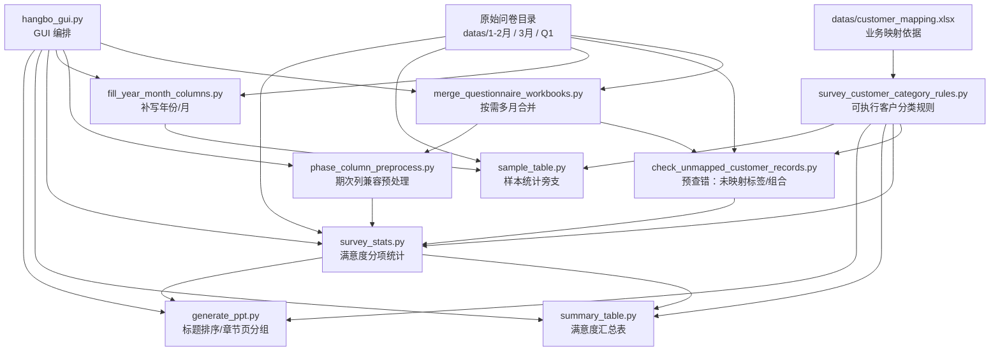

# 数据分析业务流程总览

## 1. 结论先行

当前仓库已经形成一条比较完整的数据分析业务线，但更准确地说，它不是单一线性流程，而是：

- **一条主干流程**
  - 原始问卷目录 / 合并后目录
  - `→` 数据预查错与预处理
  - `→` `survey_stats.py` 生成满意度分项统计
  - `→` `summary_table.py` 生成满意度汇总表
  - `→` `generate_ppt.py` 生成最终汇报 PPT
- **一条样本统计旁支**
  - 原始问卷目录
  - `→` `sample_table.py` 直接生成样本统计表
- **一条规则治理旁支**
  - `datas/customer_mapping.xlsx`
  - `→` `survey_customer_category_rules.py`
  - `→` 映射核查 / 未映射记录核查 / 展示顺序校验

最重要的三个判断：

1. **`survey_stats.py` 是整条业务线的核心引擎。**
2. **`generate_ppt.py` 的直接输入是 `survey_stats.py` 的分项统计结果，不是 `summary_table.py` 的汇总表。**
3. **`sample_table.py` 走的是原始数据旁路，不依赖 `survey_stats.py` 和 `summary_table.py`。**

## 2. 批次目录约定

结合当前仓库约定，业务目录可以理解为：

- 原始数据
  - `datas/1-2月`
  - `datas/3月`
  - `datas/Q1`
- 分项统计输出
  - `输出结果/1-2月`
  - `输出结果/3月`
  - `输出结果/Q1`
- 汇总统计输出
  - `汇总结果/1-2月`
  - `汇总结果/3月`
  - `汇总结果/Q1`

因此，整个业务流程天然是按“批次目录”组织的，代码层面也是围绕某个批次目录进行扫描、统计、汇总和出 PPT。

## 3. 全链路关系图

## 4. 业务基础层：映射规则是整条链的“口径源头”

### 4.1 业务事实来源

这里存在两个层次的“规则源”：

- **业务原始依据**：`datas/customer_mapping.xlsx`
- **运行时真实依据**：`survey_customer_category_rules.py`

当前主流程脚本并**不会直接读取** `datas/customer_mapping.xlsx` 来做统计，而是读取 `survey_customer_category_rules.py` 中已经固化好的规则。也就是说：

- `customer_mapping.xlsx` 更像“人工维护的业务映射表”
- `survey_customer_category_rules.py` 更像“程序真正执行的规则快照”

### 4.2 规则文件承担的职责

`survey_customer_category_rules.py` 统一定义了这些核心信息：

- 客户大类：如 `一、会展客户`、`二、餐饮客户`
- 客户类型展示名：如 `展览活动主（承）办`、`酒店餐饮客户`
- 标准来源文件：如 `展览.xlsx`、`会议.xlsx`、`餐饮.xlsx`
- 数据标签列 / 辅助标签列：如 `C`、`D`、`E`
- 数据标签值 / 辅助标签值
- 目录模式是否启用：`directory_enabled`
- 聚合规则：`aggregate_rule_names`
- 展示顺序：`sequence_number`

### 4.3 规则相关代码清单

| 代码 | 对应功能 | 关键对象 / 参数 |
| --- | --- | --- |
| `survey_customer_category_rules.py` | 定义目录模式可执行规则、展示顺序、聚合规则 | `CustomerCategoryRule`、`CUSTOMER_CATEGORY_RULES`、`DISPLAY_ORDERED_CUSTOMER_CATEGORY_RULES`、`aggregate_rule_names`、`directory_enabled` |
| `tests/test_survey_customer_category_rules.py` | 校验 Python 规则与 `datas/customer_mapping.xlsx` 是否一致 | `customer_mapping.xlsx`、`sequence_number`、`customer_group`、`customer_category` |
| `tests/test_survey_customer_mappings.py` | 校验目录模式规则、模板名、来源文件映射是否自洽 | `SOURCE_FILE_TO_CATEGORY_RULE_NAMES`、`TEMPLATE_DEFINITIONS` |
| `tests/check_customer_label_sources.py` | 从“映射表 -> 原始数据”反查数据标签是否能落到真实列和值 | `--mapping-workbook`、`--source-dir`、`--markdown-output`、`--xlsx-output` |

### 4.4 一个关键业务点：聚合型客户类型

当前最典型的聚合规则是：

- `酒店餐饮客户`

它不是直接由一个模板文件单独统计出来的，而是由以下内部组件规则合并而来：

- `酒店宴会`
- `酒店自助餐`
- `酒店餐饮-商务简餐`
- `酒店餐饮-宴会`

这意味着“客户类型”不一定和“单一模板”一一对应，后续做汇总表和 PPT 时，都要考虑这种聚合口径。

## 5. 数据预查错层：先检查“规则覆盖”和“标签质量”

这一层的价值，是在真正跑满意度统计前，先确认原始数据能不能按既定映射规则被正确识别。

### 5.1 当前批次未映射记录核查

主脚本：

- `check_unmapped_customer_records.py`

它面向**当前批次输入目录**，直接检查原始问卷中是否存在：

- 数据标签未映射
- 辅助标签 + 数据标签组合未映射
- 辅助标签为空，导致无法命中规则

适合放在主流程前面，尤其是在：

- 新批次数据第一次入仓时
- 新增问卷来源文件时
- 修改 `survey_customer_category_rules.py` 后复核时

#### 相关代码与参数

| 代码 / 函数 | 对应功能 | 关键参数 |
| --- | --- | --- |
| `check_unmapped_customer_records.py` | 对目录内标准来源文件执行未映射记录核查 | `--input-dir`、`--sheet-name`、`--log-dir`、`--log-file` |
| `run_directory_audit()` | 扫描目录内每个标准来源文件 | `input_dir`、`sheet_name` |
| `audit_source_file()` | 对单个来源文件逐行核查映射覆盖 | `source_file_name`、`workbook_path`、`sheet_name`、`df` |
| `format_directory_audit_report()` | 输出终端与日志报告 | `DirectoryAuditReport`、`log_path` |

#### 输出产物

- 终端报告
- `/logs/*.log`

#### 业务位置

- 推荐在 `survey_stats.py` 前执行
- 如果是“多月合并模式”，推荐对**合并后的有效输入目录**执行

### 5.2 映射表与源数据的一致性核查

主脚本：

- `tests/check_customer_label_sources.py`

虽然它放在 `tests/` 目录，但从功能上看，它不是普通单元测试，而是一个**规则治理工具**。它做的是：

- 从 `datas/customer_mapping.xlsx` 或 `datas/客户类别对照表V1.0.xlsx` 读取映射关系
- 自动在真实数据源中定位“哪一列像数据标签列、哪一列像辅助标签列”
- 反查哪些标签命中、哪些只部分命中、哪些组合属于表外值

这个工具更适合：

- 调整客户映射规则时使用
- 新增或变更映射表时使用
- 做“规则表与真实数据是否一致”的专题核查时使用

#### 相关代码与参数

| 代码 / 函数 | 对应功能 | 关键参数 |
| --- | --- | --- |
| `tests/check_customer_label_sources.py` | 映射表与真实数据源一致性核查 | `--mapping-workbook`、`--source-dir`、`--markdown-output`、`--xlsx-output` |
| `load_mapping_entries()` | 读取映射表行 | `workbook_path`、`sheet_name` |
| `audit_mapping_entries()` | 逐条规则匹配真实数据 | `entries`、`source_frames` |
| `render_markdown_report()` | 生成 Markdown 核查报告 | `AuditReport` |
| `write_augmented_workbook()` | 给映射表追加“标签所在列”辅助信息 | `source_workbook_path`、`output_workbook_path` |

### 5.3 关于“开始填表时间月份检查”

仓库里存在：

- 文档：`docs/开始填表时间月份检查.md`
- 测试：`tests/test_start_time_month_check.py`
- GUI 提示文案：`hangbo_gui.py`

但当前**仓库根目录缺少真正的 `check_start_time_month.py` 可执行脚本**。因此这一步目前只能视为：

- 已设计、已测试约束存在
- 但不属于当前可直接执行的主链脚本

所以在当前业务线上，它应被归类为：

- **预检能力已规划，但主流程尚未完全落地的辅助环节**

## 6. 原始数据整备层：合并、兼容、补字段

这一层的目标，是把原始 Excel 整理成更适合后续统计的状态。

### 6.1 多月数据合并

主脚本：

- `merge_questionnaire_workbooks.py`

它的作用是：

- 接收多个输入目录
- 按文件名归组
- 只处理 `问卷数据` sheet
- 将语义相同的列自动对齐
- 将不重复的新列追加到结果文件末尾

它适合以下业务场景：

- 先把 `1月`、`2月` 合并再统计
- 先把 `1-2月` 与 `3月` 合并为 `Q1`
- 某些来源文件在多个目录里分散存放

#### 相关代码与参数

| 代码 / 函数 | 对应功能 | 关键参数 |
| --- | --- | --- |
| `merge_questionnaire_workbooks.py` | 按文件名合并多个目录中的问卷 | `--input-dir`、`--output-dir`、`--recursive`、`--sheet-name` |
| `group_workbooks_by_filename()` | 按文件名聚类待合并文件 | `input_dirs`、`recursive` |
| `merge_headers()` | 语义去重后合并表头 | `sheet_data_items` |
| `align_rows()` | 将不同来源行对齐到统一表头 | `rows`、`source_headers`、`target_headers` |
| `merge_workbooks_by_filename()` | 执行整批合并 | `input_dirs`、`output_dir`、`sheet_name` |

#### 输入输出关系

- 输入：多个原始数据目录
- 输出：一个新的“可统计目录”

它是**多月场景下的上游整备步骤**，不是所有批次的必跑步骤。

### 6.2 期次列兼容预处理

主脚本：

- `phase_column_preprocess.py`

作用是：

- 检查 `问卷数据` sheet 的第三列是否存在 `一期 / 二期 / 第三期` 这类期次标记
- 若存在，则把第三列整体移动到最后一列并原地保存

这个步骤的本质是：**兼容新版源文件结构，避免后续列号模板错位。**

#### 相关代码与参数

| 代码 / 函数 | 对应功能 | 关键参数 |
| --- | --- | --- |
| `phase_column_preprocess.py` | 批量处理单个或多个 Excel 的期次列 | `inputs...`、`--sheet-name` |
| `process_phase_column_workbook()` | 识别第三列是否为期次列并移动 | `input_path`、`sheet_name` |
| `preprocess_phase_column_if_needed()` | 在其他脚本里按需触发预处理 | `input_path`、`sheet_name` |

#### 业务位置

这里有一个非常重要的实现细节：

- `phase_column_preprocess.py` 可以**独立运行**
- 但 `survey_stats.py` 在加载 Excel 时也会**自动调用** `preprocess_phase_column_if_needed()`

因此，业务上它既是：

- 一个可单独点击执行的预处理工具

也是：

- `survey_stats.py` 的内嵌前置兼容动作

### 6.3 补写年份 / 月份字段

主脚本：

- `fill_year_month_columns.py`

作用是：

- 为原始问卷 `问卷数据` sheet 写入 `年份`、`月份` 两列
- 如果列已存在，则直接覆盖原值

这个步骤对 `survey_stats.py` 不是硬依赖，但对以下场景很有价值：

- `sample_table.py` 需要按年月展开动态分组列
- GUI 需要更明确地管理批次归属
- 做季度 / 跨月样本分析时需要有稳定月份字段

#### 相关代码与参数

| 代码 / 函数 | 对应功能 | 关键参数 |
| --- | --- | --- |
| `fill_year_month_columns.py` | 批量给目录内 Excel 补写年月字段 | `--input-dir`、`--year`、`--month`、`--recursive`、`--sheet-name` |
| `apply_year_month_to_workbook()` | 处理单个工作簿 | `workbook_path`、`year`、`month`、`sheet_name` |
| `apply_year_month_to_directory()` | 整批处理目录 | `input_dir`、`year`、`month`、`recursive` |

## 7. 核心统计层：`survey_stats.py` 是主引擎

### 7.1 它负责什么

`survey_stats.py` 的核心职责是：

- 读取原始问卷 `问卷数据` sheet
- 按模板和客户类型规则筛选样本
- 计算总体、二级指标、三级指标的满意度 / 重要性
- 导出单客户类型统计结果

它输出的结果文件，是后面：

- `summary_table.py`
- `generate_ppt.py`

共同依赖的上游产物。

### 7.2 这一步的输入输出契约

#### 输入

- 单个 Excel 文件，或某个批次目录
- 读取 sheet：默认 `问卷数据`
- 客户类型识别依据：
  - 模板定义：`TEMPLATE_DEFINITIONS`
  - 目录模式规则：`survey_customer_category_rules.py`

#### 输出

默认输出为 `xlsx`，也支持：

- `csv`
- `md`

生成的表结构是稳定的三列表：

- `指标`
- `满意度`
- `重要性`

后续的 `summary_table.py` 和 `generate_ppt.py` 都依赖这个输出契约。

### 7.3 支持的运行模式

#### 模式 A：目录模式

最适合当前正式业务。

配置核心字段：

- `input_dir`
- `output_dir`
- `output_format`
- `calculation_mode`
- `sheet_name`
- `source_file_overrides`

这时脚本会：

- 遍历 `CUSTOMER_CATEGORY_RULES`
- 自动寻找标准来源文件
- 自动判断当前批次哪些客户类型能生成
- 自动跳过缺失来源文件或没有匹配身份值的客户类型

#### 模式 B：显式 `[[jobs]]` 模式

适合手工精细控制。

每个 job 可以单独指定：

- `name`
- `path`
- `sheet`
- `template`
- `role_name`
- `output_name`
- `output_format`

#### 模式 C：单任务模式

直接传命令行参数：

- `--input`
- `--template`
- `--role-name`
- `--output`

#### 模式 D：旧兼容模式

只保留给历史脚本兼容：

- `--organizer-input`
- `--exhibitor-input`
- `--visitor-input`
- `--output-dir`

### 7.4 关键参数清单

| 参数 | 含义 | 备注 |
| --- | --- | --- |
| `--config` | 批量配置文件 | 当前正式流程主要入口 |
| `--job` | 只运行指定 job | GUI 勾选客群时会追加 |
| `--dry-run` | 只校验不落文件 | 适合跑前检查 |
| `--sheet-name` | 默认来源 sheet 名 | 默认 `问卷数据` |
| `--output-format` | 覆盖输出格式 | `xlsx/csv/md` |
| `--calculation-mode` | 计算口径 | `template/summary` |
| `--output-dir` | 覆盖配置输出目录 | 批量模式有效 |
| `--input` | 单任务来源文件 | 单任务模式 |
| `--template` | 模板类型 | 单任务模式 |
| `--role-name` | 身份值 / 客户类型名 | 单任务模式 |
| `--output` | 单任务输出路径 | 单任务模式 |

### 7.5 关键函数与职责

| 代码 / 函数 | 对应功能 | 关键参数 / 对象 |
| --- | --- | --- |
| `load_batch_config()` | 读取 TOML，解析目录模式 / jobs 模式 | `config_path`、`sheet_name` |
| `discover_directory_jobs()` | 按目录模式自动展开可统计客户类型 | `BatchConfig` |
| `build_customer_category_rule_mask()` | 根据规则构造筛选掩码 | `df`、`CustomerCategoryRule` |
| `compute_role_stats()` | 计算总体、二级、三级指标 | `df`、`RoleDefinition`、`calculation_mode` |
| `generate_customer_category_report_bundle()` | 生成客户类型报表，支持聚合规则 | `input_path`、`category_rule`、`output_path` |
| `run_config_mode()` | 正式批量运行主入口 | `args` |

### 7.6 `template` 与 `summary` 两种计算口径

这是这条业务线上最容易混淆的地方。

#### `template`

- 按模板原始二级指标结构计算
- 保持和原始模板口径一致
- 是当前默认和推荐口径

#### `summary`

- 先把模板口径重组为汇总表口径再计算
- 比如把 `会展服务 / 会场服务` 统一归并到 `产品服务`
- 会改变部分二级指标结构，也可能改变总体分口径

所以：

- 如果后续汇总和 PPT 仍然希望遵循原模板口径，优先用 `template`
- 如果希望分项结果本身就和汇总口径完全一致，再考虑 `summary`

### 7.7 目录模式的附加业务行为

目录模式不是只“找得到就算”，它还会同时产出三类业务提示：

- **缺少来源文件**
- **来源文件存在但没有匹配身份值**
- **存在未映射客户标签组合**

最后这类“未映射标签组合”就是通过：

- `build_unmapped_customer_category_notices_for_source()`

在扫描目录时顺便做出来的，这说明：

- `survey_stats.py` 本身已经内嵌了一部分“预查错能力”
- 但更详细的逐行核查仍然建议用 `check_unmapped_customer_records.py`

## 8. 满意度汇总层：`summary_table.py`

### 8.1 它读取什么

`summary_table.py` **不读取原始问卷**，只读取：

- `survey_stats.py` 输出目录中的单客户类型统计结果 `xlsx`

它识别输入文件时，依赖的不只是列名，还依赖格式：

- 表头必须有 `指标`、`满意度`
- 总体行 / 二级指标行 / 三级指标行，靠填充色区分

因此，`summary_table.py` 对上游结果有比较强的格式契约依赖。

### 8.2 它输出什么

输出一张“客户类型满意度汇总表”：

- `客户大类`
- `样本类型`
- `总分`
- `产品服务`
- `硬件设施`
- `配套服务`
- `智慧场馆/服务`
- `餐饮服务`

### 8.3 这一步的业务实质

它不是简单拼表，而是做了三件事：

1. **把分项统计文件识别成快照对象**
2. **按照客户大类与客户类型展示顺序重建汇总行**
3. **把不同模板中的二级指标映射到统一汇总列**

因此，它的真实上游是：

- `survey_stats.py` 的输出格式契约
- `survey_customer_category_rules.py` 的展示顺序与客户类型定义

### 8.4 关键参数清单

| 参数 | 含义 |
| --- | --- |
| `--input-dir` | `survey_stats.py` 输出目录 |
| `--output-dir` | 汇总表输出目录 |
| `--output-name` | 汇总文件名 |
| `--recursive` | 是否递归扫描子目录 |

### 8.5 关键函数与职责

| 代码 / 函数 | 对应功能 | 关键参数 / 对象 |
| --- | --- | --- |
| `load_report_snapshot()` | 读取单个客户类型统计表为快照 | `report_path` |
| `build_summary_row_definitions()` | 依据展示规则构造汇总行定义 | `DISPLAY_ORDERED_CUSTOMER_CATEGORY_RULES` |
| `build_summary_selectors()` | 把不同客户类型映射到统一汇总列 | `CustomerCategoryRule` |
| `build_summary_rows()` | 生成最终汇总数据行 | `reports` |
| `generate_summary_report()` | 生成汇总 Excel | `input_dir`、`output_dir`、`output_name` |

### 8.6 与主流程的关系

从**数据依赖**上看：

- `summary_table.py <- survey_stats.py`

从**业务操作顺序**上看：

- 先跑 `survey_stats.py`
- 再跑 `summary_table.py`

这一层是满意度业务的“正式汇总口径”输出。

## 9. 样本汇总旁支：`sample_table.py`

### 9.1 它和满意度汇总不是同一条输入链

`sample_table.py` 直接读取：

- 原始问卷目录

而不是读取：

- `survey_stats.py` 输出
- `summary_table.py` 输出

所以它与满意度汇总的关系更像：

- **共享同一批原始数据**
- **共享同一套客户类型规则**
- **但统计目标不同**

### 9.2 它负责什么

它负责：

- 统计每个客户类型的目标样本量
- 统计每个客户类型的实际执行样本量
- 按 `年份 + 月份` 展开动态月份分组列
- 输出一个独立的样本统计 Excel

### 9.3 关键配置来源

默认配置文件：

- `sample_table.default.toml`

配置内容包括：

- 标题
- sheet 名
- 输出文件名
- 每行客户类型的展示顺序
- 目标样本量
- 对应规则名
- 手工覆盖值
- 特殊“按月份列求和”的行

### 9.4 关键参数清单

| 参数 | 含义 |
| --- | --- |
| `--input-dir` | 原始问卷目录 |
| `--output-dir` | 输出目录 |
| `--output-name` | 输出文件名 |
| `--config` | 样本统计配置文件 |
| `--source-sheet-name` | 原始数据 sheet 名 |
| `--default-year` | 缺少年份时的默认值 |
| `--month-group` | 手工定义月份分组，支持重复传入 |

### 9.5 关键函数与职责

| 代码 / 函数 | 对应功能 | 关键参数 / 对象 |
| --- | --- | --- |
| `load_sample_table_config()` | 读取样本统计配置 | `config_path` |
| `prepare_sample_table_rows()` | 为每个客户类型准备数据源与筛选掩码 | `input_dir`、`config` |
| `build_customer_category_rule_mask()` | 根据客户规则筛选原始样本 | `df`、`rule` |
| `resolve_sample_groups()` | 自动或手工确定月份分组列 | `prepared_rows`、`sample_groups` |
| `build_sample_table_rows()` | 生成样本统计行结果 | `input_dir`、`config`、`default_year` |
| `generate_sample_table_report()` | 输出样本统计 Excel | `input_dir`、`output_dir` |

### 9.6 业务位置

推荐把它看作：

- **原始数据准备完成后的并行旁支**

也就是：

- 可在 `survey_stats.py` 之后补跑
- 也可单独从原始数据直接跑

但如果希望月份分组列准确，通常建议先完成：

- `fill_year_month_columns.py`

## 10. PPT 生成层：`generate_ppt.py`

### 10.1 直接输入是什么

`generate_ppt.py` 的直接输入是：

- `survey_stats.py` 输出目录中的分项统计结果 `xlsx`

不是：

- `summary_table.py` 生成的汇总表

这一点非常关键，因为实际业务操作顺序里，虽然常常是“先汇总、后出 PPT”，但代码上的数据依赖并不是：

- `generate_ppt.py <- summary_table.py`

而是：

- `generate_ppt.py <- survey_stats.py`

### 10.2 它负责什么

它负责：

- 批量扫描分项统计结果 Excel
- 依据客户分类规则决定页面顺序和标题
- 把每个 Excel 渲染成 1 页数据页
- 按配置插入客户大类章节页
- 按条件追加图表页
- 按需调用 LLM 生成备注页分析

### 10.3 关键配置字段

| 字段 / 参数 | 含义 |
| --- | --- |
| `template_path` / `--template-path` | PPT 模板文件 |
| `input_dir` / `--input-dir` | Excel 输入目录 |
| `output_ppt` / `--output-ppt` | 输出 PPT 路径 |
| `sheet_name_mode` | `first` 或 `named` |
| `sheet_name` | 指定 sheet 名 |
| `section_mode` / `--section-mode` | `auto/template/summary` |
| `blank_display` | 空值显示文本 |
| `title_suffix` | 标题后缀 |
| `max_single_table_rows` | 单表最大明细行数 |
| `max_split_table_rows` | 左右双表每侧最大行数 |
| `template_slide_index` | 模板页索引 |
| `category_intro_slides` | 客户大类章节页配置 |
| `chart_page.*` | 图表页开关、占位文案、DPI |
| `llm_notes.*` | 备注页分析配置 |
| `layout.*` | 表格、图表、文本框布局 |

### 10.4 关键函数与职责

| 代码 / 函数 | 对应功能 | 关键参数 / 对象 |
| --- | --- | --- |
| `load_batch_config()` | 读取 PPT TOML 配置 | `config_path` |
| `discover_input_files()` | 扫描并排序输入 Excel | `PptBatchConfig` |
| `read_report_rows()` | 读取分项统计表三列表 | `workbook_path`、`sheet_name_mode` |
| `resolve_section_definition()` | 判断按 template / summary 哪套口径识别二级标题 | `role_name`、`rows`、`section_mode` |
| `choose_detail_layout()` | 决定单表还是左右双表布局 | `detail_rows`、`max_single_table_rows`、`max_split_table_rows` |
| `render_workbook_slide()` | 生成单个客户类型的数据页 | `slide`、`workbook_path`、`config` |
| `generate_presentation()` | 生成整份 PPT | `config`、`dry_run` |
| `ppt_chart_renderer.py` | 图表页图片生成器 | `ChartPoint`、`ChartRenderConfig` |

### 10.5 页面排序和标题口径

PPT 的排序与标题并不是简单按文件名排序，而是复用了：

- `DISPLAY_ORDERED_CUSTOMER_CATEGORY_RULES`

这带来两个结果：

1. 页面顺序与业务展示顺序一致
2. 页面标题会自动转换成“客户大类——客户类型展示名”

因此，PPT 层不仅是展示输出层，还是一个**强依赖客户分类口径**的二次编排层。

## 11. GUI 编排层：`hangbo_gui.py` 把散脚本串成业务主流程

虽然仓库中很多能力本身是独立脚本，但 `hangbo_gui.py` 已经把它们组织成一条明确的业务主流程。

### 11.1 GUI 中定义的主流程顺序

GUI 主流程步骤顺序是固定拼装的：

1. `merge_workbooks`（多月模式时可选）
2. `phase_preprocess`
3. `fill_year_month`
4. `survey_stats`
5. `summary_table`
6. `generate_ppt`

这说明 GUI 视角下的正式业务线是：

- 原始数据整备
- 分项统计
- 汇总表
- PPT

### 11.2 GUI 的真实作用

`hangbo_gui.py` 并不重写算法，而是：

- 生成运行时 TOML
- 组装命令行参数
- 调用现有脚本
- 实时展示日志和进度

也就是说，它更像：

- **业务流程调度层**

而不是：

- 统计逻辑本身

### 11.3 GUI 相关代码点

| 代码 / 函数 | 对应功能 | 关键参数 / 对象 |
| --- | --- | --- |
| `build_main_workflow_step_keys()` | 定义主流程步骤顺序 | `GuiBatchConfig`、`MainWorkflowSelection` |
| `build_merge_command()` | 组装合并命令 | `GuiBatchConfig` |
| `build_phase_preprocess_command()` | 组装期次预处理命令 | `GuiBatchConfig` |
| `build_fill_year_month_command()` | 组装补年月命令 | `GuiBatchConfig` |
| `build_survey_stats_command()` | 生成 `survey_stats.py` 命令与运行时 TOML | `GuiBatchConfig`、`selected_job_names` |
| `build_summary_command()` | 组装汇总表命令 | `GuiBatchConfig` |
| `build_ppt_command()` | 生成 `generate_ppt.py` 命令与运行时 TOML | `GuiBatchConfig` |

### 11.4 一个实际业务判断

当前 GUI 主流程里**没有把 `sample_table.py` 纳入“一键主流程”**。这意味着在当前产品设计里：

- 样本统计是重要结果
- 但仍被看作相对独立的旁支报表

而不是主干交付链里“必须串行执行”的一步。

## 12. 按业务顺序整理的脚本总表

| 顺序 | 代码 | 对应功能 | 典型输入 | 典型输出 | 关键参数 |
| --- | --- | --- | --- | --- | --- |
| 0 | `survey_customer_category_rules.py` | 统一定义客户分类运行口径 | `datas/customer_mapping.xlsx` 的业务规则沉淀 | 可执行规则对象 | `CustomerCategoryRule`、`directory_enabled`、`aggregate_rule_names` |
| 1 | `tests/check_customer_label_sources.py` | 规则治理：映射表与真实数据反查 | 映射表、原始数据目录 | Markdown / 增强版 xlsx | `--mapping-workbook`、`--source-dir` |
| 2 | `check_unmapped_customer_records.py` | 批次预查错：找出未映射标签记录 | 原始数据目录 / 合并后目录 | 终端报告、`logs/*.log` | `--input-dir`、`--sheet-name`、`--log-file` |
| 3 | `merge_questionnaire_workbooks.py` | 多月 / 多目录数据合并 | 多个原始数据目录 | 合并后的原始数据目录 | `--input-dir`、`--output-dir` |
| 4 | `phase_column_preprocess.py` | 兼容期次列结构 | 原始 Excel 文件列表 | 原地更新 Excel | `inputs...`、`--sheet-name` |
| 5 | `fill_year_month_columns.py` | 补写 `年份` / `月份` 字段 | 原始数据目录 | 原地更新 Excel | `--input-dir`、`--year`、`--month` |
| 6 | `survey_stats.py` | 生成满意度分项统计 | 原始数据目录 / 单个 Excel | `输出结果/*/*.xlsx` | `--config`、`--calculation-mode`、`--job` |
| 7 | `summary_table.py` | 生成满意度汇总表 | 分项统计输出目录 | `汇总结果/*/客户类型满意度汇总表.xlsx` | `--input-dir`、`--output-dir`、`--output-name` |
| 8 | `sample_table.py` | 生成样本统计表 | 原始数据目录 | `汇总结果/*/客户类型样本统计表.xlsx` | `--input-dir`、`--config`、`--month-group` |
| 9 | `generate_ppt.py` | 生成汇报 PPT | 分项统计输出目录 | `输出结果/*满意度报告.pptx` | `--config`、`--section-mode`、`--dry-run` |
| 10 | `hangbo_gui.py` | 编排整条业务线 | 批次配置、目录、模板 | 调度执行日志、运行时 TOML | GUI 页面配置项 |

## 13. 推荐理解方式：一条主干，两条旁支

如果要把当前代码库抽象成最清晰的业务认识，我建议用下面这个框架理解：

### 13.1 主干

- 原始问卷
- `→` 预查错 / 预处理
- `→` `survey_stats.py`
- `→` `summary_table.py`
- `→` `generate_ppt.py`

### 13.2 样本旁支

- 原始问卷
- `→` `sample_table.py`

### 13.3 规则治理旁支

- 映射表 / 规则文件
- `→` 标签一致性核查
- `→` 未映射记录核查
- `→` 规则顺序与模板映射校验

## 14. 最后的判断：当前代码库是不是完整的数据分析业务线

结论是：**是，而且主干已经比较清晰。**

当前代码库已经覆盖了这几个关键业务能力：

- 映射规则管理
- 批次级预查错
- 多目录原始数据合并
- 源数据结构兼容预处理
- 满意度分项统计
- 满意度汇总统计
- 样本量统计
- PPT 批量生成
- GUI 流程编排

当前仍有一个明显的“未完全落地环节”：

- `check_start_time_month.py` 的文档与测试存在，但脚本文件缺失

除此之外，整体上它已经可以被理解为：

- **一套围绕问卷原始数据，面向月度 / 季度批次，产出分项统计、汇总表、样本表和汇报 PPT 的完整分析流水线。**
